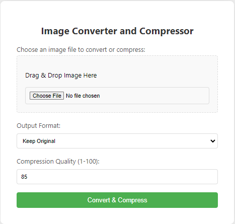

# Image Converter and Compressor

## ~~PNG to JPG Image Converter~~

## Description

This web application allows users to convert and compress images in various formats. Built with Flask and using the Pillow library, the app supports multiple output formats and allows users to specify the quality of the compressed image. The application is deployed on Vercel for easy access and use.
>It's been a tough year and I'm trying to get my groove back. Lucky number... I lost count, but I'm back on the grind.

### Live Link

[Image Converter](https://image-converter-psi.vercel.app/)

## Installation

1. Clone the repository:

```bash
git clone https://github.com/ESPersonnel/image-converter.git
cd image-converter
```

2. Install dependencies:

```
pip install -r requirements.txt
```

3. Run the script:

```bash
python app.py
```

## Usage

1. Web Interface:

    - Navigate to the app's URL.
    - Upload an image file using the provided form.
    - Select the desired output format and compression quality.
    - Click "Convert & Compress" to process the image and download the result.
2. Command-line Interface (For Local Testing):

    - Place the image you want to convert in the same directory as the script.
    - Run the script using the instructions in the installation section.

## Minimum Viable Product (MVP)

- [x] Converts a single PNG image to JPG format.
- [x] ~~Command-line interface for easy usage.~~

> The app is developing quite well, I'm adding more features as I go along.

- [x] Create a simple UI to choose an image and convert it.
- [ ] Add support for batch processing multiple images.
- [x] Possibly add compression options for the JPG output.
- [x] Add quality control options for the JPG output.
- [x] Add reverse functionality to convert JPG images to PNG format.
- [x] Add multi-conversion functionality to convert images to multiple formats.


## Future Updates

- [ ] Support for batch processing multiple images.
- [ ] Enhanced error handling and user feedback.
- [ ] Improved UI/UX design and responsiveness.
- [ ] Additional image formats and conversion options.
- [ ] Image editing functionality (e.g., cropping, resizing, rotating).

## Screenshots



## Project File Structure

    |--- Image Converter
    |    |--- app.py
    |    |--- requirements.txt
    |    |--- README.md
    |    |--- templates
    |    |    |--- index.html
    |    |--- static
    |    |    |--- css
    |    |    |    |--- style.css
    |    |--- uploads
    |    |    |--- jpg
    |    |    |    |--- jpg.jpg
    |    |    |--- png
    |    |    |    |--- png.png
    |    |    |--- jpeg
    |    |    |    |--- jpeg.jpeg

## License

[MIT License](https://opensource.org/licenses/MIT)
